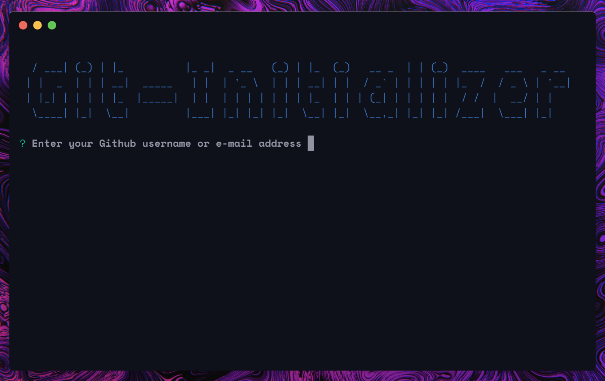

# A CLI GitHub Repo Creator

This CLI app helps eliminate the hassle of creating repo's on GitHub and adding it to your local dev folder, by a simple execution and preference selection when prompted.

#### **Note: Github accounts with 2-Step-Authentication aren't supported yet!**

## How it works

On execution:

1. User is prompted to enter GitHub login credentials for authentication.(One time event)

2. Credentials are automatically & safely stored in the ~/User folder for safe keeping.

3. The necessities for creating and and linking a repository on GitHub fall in.

4. Select your preferences and you are done and ready for development.

## Usage

1. Clone the repository to desired location.
2. Run `npm install` in the directory to get dependencies.
3. Install the module globally by running `npm install -g`
4. Run `git-initializer <repo-name> <repository description>`

Done!
